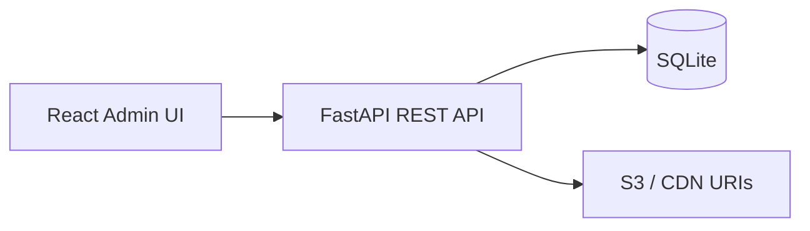

# Stream Catalog

Title management (TM) and media asset management (MAM) for video streaming services. Manage your content hierarchy—movies, series, seasons, episodes—and register masters, artwork, subtitles, and promos with storage locations and processing status.

## Architecture



| Layer | Responsibility |
|-------|----------------|
| **Titles** | Slug, metadata, lifecycle (`draft` → `published`), parent/child hierarchy, territories, availability windows |
| **Media assets** | Typed assets (`video_master`, `poster`, `subtitle`, …), storage URI, technical metadata, processing status |
| **API** | CRUD, search/filter, title tree endpoint |
| **UI** | Dashboard, title editor, asset registry |

## Quick start

### Backend

```bash
cd stream-catalog/backend
python3.13 -m venv .venv   # Python 3.12–3.13 recommended
source .venv/bin/activate
pip install -r requirements.txt
uvicorn app.main:app --reload --port 8000
```

Or run both services: `chmod +x scripts/dev.sh && ./scripts/dev.sh`

API docs: http://127.0.0.1:8000/docs

### Frontend

```bash
cd stream-catalog/frontend
npm install
npm run dev
```

Admin UI: http://localhost:5173

Sample data (series *Neon Drift*, movie *Midnight Express Lane*, linked assets) is seeded on first API startup.

### Metadata import (New Title)

When creating a title, use **Import metadata** to pull genre, release year, studio, cast, crew, synopsis, and more from [TMDB](https://www.themoviedb.org/). Add a free API key to `backend/.env`:

```
TMDB_API_KEY=your_key_here
```

Get a key at https://www.themoviedb.org/settings/api — licensor is left for manual entry (not in TMDB).

## API overview

| Method | Path | Description |
|--------|------|-------------|
| `GET` | `/api/v1/titles` | List titles (`?q=`, `?title_type=`, `?parent_id=`) |
| `GET` | `/api/v1/titles/tree` | Full hierarchy |
| `POST` | `/api/v1/titles` | Create title |
| `GET` | `/api/v1/assets` | List assets (`?title_id=`, `?asset_type=`, `?status=`) |
| `POST` | `/api/v1/assets` | Register asset |

## Cloud deployment (GitHub + Amplify + Render)

See **[DEPLOYMENT.md](./DEPLOYMENT.md)** for step-by-step setup:

- **GitHub** — source of truth
- **Amplify** — React admin UI
- **Render** — FastAPI API (replaces AWS App Runner, which is in maintenance mode)
- **Neon Postgres** — shared cloud database

## Production extensions

- S3 pre-signed uploads
- S3/GCS pre-signed upload flow and transcoding webhooks
- Rights management and geo-availability rules engine
- Audit log and role-based access control
- Integration with packagers / origin (HLS/DASH manifests)

## Project layout

```
stream-catalog/
├── backend/app/     # FastAPI, SQLAlchemy models, routers
├── frontend/src/    # React admin UI
├── data/            # SQLite database (created at runtime)
└── README.md
```
