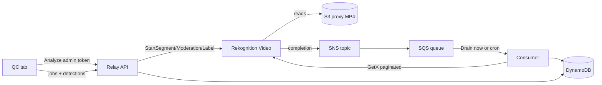

# Amazon Rekognition Video — local setup guide

Step-by-step instructions for running Relay’s Rekognition QC flow on your machine and wiring
it to AWS. Use this doc for **day-to-day local development**. For the one-time AWS CLI
infrastructure bundle (SNS, SQS, DynamoDB, IAM), see
[`REKOGNITION_AWS_SETUP.md`](./REKOGNITION_AWS_SETUP.md).

---

## What you are setting up

Relay analyzes **H.264 MP4 proxies in S3** with three Rekognition Video features (segments,
moderation, labels). Jobs run asynchronously; completion arrives via **SNS → SQS**, and a
consumer drains the queue into **DynamoDB**. The **QC tab** on each asset detail page shows
job status and time-coded results.



---

## Prerequisites

| Tool | Version / notes |
|------|-----------------|
| **Git** | Clone `stream-catalog`, branch `main` |
| **Python** | 3.12–3.13 recommended (3.9 may work but is unsupported) |
| **Node.js** | 18+ (LTS or current) |
| **AWS CLI** | v2, authenticated for real Rekognition testing |
| **Optional: MinIO** | Started automatically by `./scripts/dev.sh` when `AWS_ENDPOINT_URL` is set |

**AWS account** with permission to create SNS, SQS, DynamoDB, IAM roles, and run Rekognition
Video (or use an existing dev account / profile such as `stream-catalog-dev`).

**Cost awareness:** each Analyze run starts up to three async Rekognition jobs. Use short
test clips and avoid re-analyzing the same asset repeatedly.

---

## Step 1 — Get the code on `main`

```bash
cd /path/to/stream-catalog
git checkout main
git pull origin main
```

Confirm Rekognition files exist (sanity check):

```bash
ls backend/app/services/rekognition/
ls frontend/src/components/RekognitionQcTab.tsx
```

---

## Step 2 — Install dependencies

### Backend

```bash
cd backend
python3.12 -m venv .venv    # or python3 -m venv .venv
source .venv/bin/activate
pip install -r requirements.txt
```

### Frontend

```bash
cd ../frontend
npm install
```

---

## Step 3 — Base environment (works without AWS)

Copy examples if you are starting fresh:

```bash
cp backend/.env.example backend/.env
cp frontend/.env.example frontend/.env.local
```

Minimum for local UI + seeded catalog:

**`backend/.env`**

```bash
DATABASE_URL=sqlite:///../data/catalog.db
CORS_ORIGINS=http://localhost:5173,http://127.0.0.1:5173
SEED_ON_STARTUP=true
TMDB_API_KEY=<your-tmdb-key>          # optional for titles

# Admin — required for Analyze and Drain now in the QC tab
ADMIN_API_KEY=devkey
REKOGNITION_CONSUMER_SECRET=dev-rekognition-consumer-secret
```

**`frontend/.env.local`**

```bash
VITE_ADMIN_API_KEY=devkey               # must match ADMIN_API_KEY
```

### Optional: MinIO for ingest (S3-compatible local storage)

If you use MinIO for deliveries/ingest, keep these in `backend/.env`:

```bash
AWS_ACCESS_KEY_ID=streamcatalog
AWS_SECRET_ACCESS_KEY=streamcatalog-dev-secret
AWS_REGION=us-east-1
AWS_ENDPOINT_URL=http://127.0.0.1:9000
INGEST_S3_BUCKET=stream-catalog-ingest
INGEST_S3_PREFIX=deliveries
INGEST_OPERATOR_TOKEN=<random-token>
```

And in `frontend/.env.local`:

```bash
VITE_INGEST_OPERATOR_TOKEN=<same-token>
```

`./scripts/dev.sh` starts MinIO on port 9000 when `AWS_ENDPOINT_URL` is present.

> **Important:** MinIO works for **ingest only**. Rekognition, SQS, and DynamoDB require
> **real AWS**. Before testing Analyze (Step 6), you must point Rekognition-related calls at
> AWS — see [Step 5 — MinIO vs real AWS](#step-5--minio-vs-real-aws).

---

## Step 4 — Start Relay locally

From the repo root:

```bash
./scripts/dev.sh
```

| Service | URL |
|---------|-----|
| Admin UI | http://localhost:5173 |
| API | http://localhost:8000 |
| API health | http://localhost:8000/health |

### Verify the QC UI (no AWS required)

1. Open **Media assets**.
2. Click an **asset name** or the **QC** button on a row.
3. Open the **QC** tab.

You should see Analyze, Drain now, job status placeholders, and empty results. **Analyze**
returns “not configured” until Step 5 — that is expected.

---

## Step 5 — Provision AWS infrastructure

Run the CLI bundle in [`REKOGNITION_AWS_SETUP.md`](./REKOGNITION_AWS_SETUP.md) **sections
0–6** in order. That creates:

- S3 analysis bucket (or confirms your existing ingest bucket)
- SNS topic + SQS queue + DLQ
- DynamoDB tables (`relay_rekognition_jobs`, `relay_rekognition_detections`)
- Rekognition service role + app IAM user + access keys

Keep the exported values from section 0 handy:

- `REKOGNITION_ROLE_ARN`
- `REKOGNITION_SNS_TOPIC_ARN` (from `$SNS_TOPIC_ARN`)
- `REKOGNITION_SQS_QUEUE_URL` (from `$SQS_QUEUE_URL`)
- `S3_ANALYSIS_BUCKET`
- `AWS_ACCESS_KEY_ID` / `AWS_SECRET_ACCESS_KEY` (from section 6, or use `AWS_PROFILE`)

### AWS SSO (recommended on a laptop)

```bash
aws configure sso --profile stream-catalog-dev
aws sso login --profile stream-catalog-dev
```

You can use `AWS_PROFILE=stream-catalog-dev` instead of long-lived access keys in
`backend/.env`.

---

## Step 6 — Wire Rekognition into `backend/.env`

Add or uncomment these keys (see also section 7 of
[`REKOGNITION_AWS_SETUP.md`](./REKOGNITION_AWS_SETUP.md)):

```bash
AWS_REGION=us-east-1
# Pick ONE credential style:
AWS_PROFILE=stream-catalog-dev
# OR (typical for Render / CI):
# AWS_ACCESS_KEY_ID=...
# AWS_SECRET_ACCESS_KEY=...

S3_ANALYSIS_BUCKET=<your-bucket>        # often same as INGEST_S3_BUCKET (decision 1A)
REKOGNITION_ROLE_ARN=arn:aws:iam::...
REKOGNITION_SNS_TOPIC_ARN=arn:aws:sns:...
REKOGNITION_SQS_QUEUE_URL=https://sqs....
DDB_JOBS_TABLE=relay_rekognition_jobs
DDB_DETECTIONS_TABLE=relay_rekognition_detections
REKOGNITION_CONSUMER_SECRET=<long-random-string>   # openssl rand -hex 32
ADMIN_API_KEY=devkey                                 # already set in Step 3
```

Restart `./scripts/dev.sh` after any `.env` change.

### Step 5 — MinIO vs real AWS

Relay applies `AWS_ENDPOINT_URL` to **all** AWS clients (S3, Rekognition, SQS, DynamoDB).
MinIO does not implement Rekognition.

**For Rekognition end-to-end testing**, use one of these approaches:

| Approach | What to do |
|----------|------------|
| **A. Real AWS only** | Comment out `AWS_ENDPOINT_URL`. Use `AWS_PROFILE` or real access keys. Point `INGEST_S3_BUCKET` / `S3_ANALYSIS_BUCKET` at your real S3 bucket. |
| **B. Toggle when testing** | Keep MinIO for day-to-day ingest work. Before Analyze, comment out `AWS_ENDPOINT_URL`, restart the API, run your test, then restore MinIO settings. |
| **C. Two env files** | Maintain `backend/.env.minio` and `backend/.env.aws`; copy the one you need to `backend/.env` before starting the server. |

The app considers Rekognition “configured” when **both** `REKOGNITION_ROLE_ARN` and
`REKOGNITION_SNS_TOPIC_ARN` are non-empty (`rekognition_configured` in `config.py`).

---

## Step 7 — First end-to-end analyze

### 7a. Put a test video in S3

Rekognition requires an **H.264 MP4** (or MOV) object in the bucket named by
`S3_ANALYSIS_BUCKET`.

```bash
aws s3 cp ./sample-proxy.mp4 s3://$S3_ANALYSIS_BUCKET/deliveries/sample-proxy.mp4
```

Or use an asset whose `storage_uri` already points at an object in that bucket.

### 7b. Start analysis from the QC tab

1. Open **Media assets** → asset → **QC** tab.
2. Optionally open **Choose video** and pick the S3 key (picker browses `INGEST_S3_BUCKET`;
   for decision 1A these buckets should match).
3. Click **Analyze**.

Expected behavior:

- Three features start: **Segments**, **Moderation**, **Labels**.
- Job rows show **IN_PROGRESS**, then **SUCCEEDED** (Rekognition usually takes minutes).
- Re-running Analyze skips features already **IN_PROGRESS** or **SUCCEEDED** (idempotent).

### 7c. Drain completions into DynamoDB

Rekognition publishes to SNS when jobs finish. Relay does **not** poll job status; it only
learns completion from SQS.

**Locally:** click **Drain now** on the QC tab (uses your admin token).

**Or via curl:**

```bash
curl -X POST http://localhost:8000/api/v1/rekognition/drain \
  -H "X-Admin-Token: devkey"
```

**Or** wait for the GitHub Actions cron (production) — see Step 8.

After a successful drain, refresh the QC tab. You should see:

- Technical cues and shot boundaries on the timeline
- Moderation flags in a table
- Searchable label chips

### 7d. Manual consumer (optional)

The scheduled job hits `POST /api/v1/rekognition/consume` with a dedicated secret (not the
admin token):

```bash
curl -X POST http://localhost:8000/api/v1/rekognition/consume \
  -H "X-Rekognition-Consumer-Secret: <REKOGNITION_CONSUMER_SECRET>"
```

**Drain now** is the same consumer logic but authenticated with `X-Admin-Token` for local
demos.

---

## Step 8 — Production / deployed Relay

When you deploy the API to **Render** and the UI to **Amplify**:

### Render (API service environment)

Set all Rekognition keys from Step 6, plus:

| Variable | Notes |
|----------|-------|
| `ADMIN_API_KEY` | Long random string |
| `REKOGNITION_CONSUMER_SECRET` | Long random string; **never** expose to the browser |
| `AWS_ACCESS_KEY_ID` / `AWS_SECRET_ACCESS_KEY` | From IAM app user (SSO not available on Render) |
| `CORS_ORIGINS` | Your Amplify URL |

Do **not** set `AWS_ENDPOINT_URL` in production.

### Amplify (frontend environment)

| Variable | Notes |
|----------|-------|
| `VITE_API_URL` | Render API URL |
| `VITE_ADMIN_API_KEY` | Same value as `ADMIN_API_KEY` (existing app pattern) |

### GitHub Actions — scheduled consumer

Repo: **Settings → Secrets and variables → Actions**

| Name | Value |
|------|-------|
| Secret `REKOGNITION_CONSUMER_SECRET` | Same as on Render |
| Variable `API_URL` (optional) | Render API base URL if not the default |

Workflow: `.github/workflows/rekognition-consume.yml` (every ~5 minutes + manual dispatch).

---

## Step 9 — Verification checklist

Use this list to confirm everything is wired:

- [ ] `./scripts/dev.sh` starts API (:8000) and UI (:5173) without errors
- [ ] **Media assets** row shows **QC** button; asset detail has **QC** tab
- [ ] `GET http://localhost:8000/health` returns OK
- [ ] With Rekognition env unset: Analyze returns 503 “not configured”
- [ ] With Rekognition env set and `AWS_ENDPOINT_URL` removed: Analyze returns 200 and jobs appear
- [ ] Jobs move to **SUCCEEDED** in AWS (or QC tab after refresh)
- [ ] **Drain now** returns processed count > 0 when messages are in the queue
- [ ] Timeline / moderation / labels render after drain
- [ ] `pytest tests/test_rekognition_*.py` passes (optional; see below)

---

## Step 10 — Run automated tests locally (optional)

Rekognition unit tests use **moto** (no real AWS charges):

```bash
cd backend
source .venv/bin/activate
pip install pytest moto
pytest tests/test_rekognition_ddb.py tests/test_rekognition_start.py tests/test_rekognition_consumer.py -v
```

Tests unset `AWS_ENDPOINT_URL` internally so they do not hit MinIO.

---

## Troubleshooting

| Symptom | Likely cause | Fix |
|---------|--------------|-----|
| QC tab missing | Old branch or cache | `git checkout main && git pull`; hard-refresh browser |
| Analyze → 503 “not configured” | Missing ARNs | Set `REKOGNITION_ROLE_ARN` and `REKOGNITION_SNS_TOPIC_ARN`; restart API |
| Analyze → 503 with MinIO in `.env` | `AWS_ENDPOINT_URL` sent to Rekognition | Comment out endpoint; use real AWS credentials |
| Analyze → 400 on video | Wrong codec/container | Use H.264 MP4 or MOV proxy in `S3_ANALYSIS_BUCKET` |
| Jobs stuck IN_PROGRESS | Normal async delay | Wait; Rekognition can take several minutes |
| Jobs SUCCEEDED but no results | Queue not drained | Click **Drain now** or run consume curl |
| Drain → 0 processed | Empty queue or wrong queue URL | Confirm `REKOGNITION_SQS_QUEUE_URL`; check SNS subscription in AWS console |
| AccessDenied on Start* | IAM / PassRole | Re-run IAM sections in `REKOGNITION_AWS_SETUP.md`; ensure app user has `iam:PassRole` on the service role |
| S3 picker empty | MinIO not running or wrong bucket | Start `./scripts/dev.sh`; check `INGEST_S3_BUCKET` and operator token |
| Admin actions fail | Token mismatch | `VITE_ADMIN_API_KEY` must equal `ADMIN_API_KEY`; restart Vite after `.env.local` change |

### Inspect the SQS queue

```bash
aws sqs get-queue-attributes \
  --queue-url "$REKOGNITION_SQS_QUEUE_URL" \
  --attribute-names ApproximateNumberOfMessages ApproximateNumberOfMessagesNotVisible
```

### DLQ messages

See section 8 of [`REKOGNITION_AWS_SETUP.md`](./REKOGNITION_AWS_SETUP.md) for redrive steps.

---

## Quick reference — environment variables

| Variable | Required for Analyze | Required for Drain/Consume | Browser |
|----------|---------------------|---------------------------|---------|
| `ADMIN_API_KEY` | Yes | Yes (Drain now) | via `VITE_ADMIN_API_KEY` |
| `REKOGNITION_CONSUMER_SECRET` | No | Yes (cron / consume endpoint) | Never |
| `REKOGNITION_ROLE_ARN` | Yes | No | No |
| `REKOGNITION_SNS_TOPIC_ARN` | Yes | No | No |
| `REKOGNITION_SQS_QUEUE_URL` | No | Yes | No |
| `S3_ANALYSIS_BUCKET` | Yes | No | No |
| `DDB_JOBS_TABLE` | Yes (implicit) | Yes | No |
| `DDB_DETECTIONS_TABLE` | No | Yes | No |
| `AWS_REGION` | Yes | Yes | No |
| `AWS_PROFILE` or access keys | Yes | Yes | No |

---

## Related docs

- [`REKOGNITION_AWS_SETUP.md`](./REKOGNITION_AWS_SETUP.md) — one-time AWS CLI infrastructure
- [`backend/.env.example`](../backend/.env.example) — all env keys with comments
- [`frontend/.env.example`](../frontend/.env.example) — frontend env keys

---

## Suggested order of work

1. **Steps 1–4** — UI running locally (same day)
2. **Step 5** — AWS infra bundle (~30–45 min, one time)
3. **Steps 6–7** — first successful analyze + drain
4. **Step 8** — deploy + GitHub cron when you are ready for unattended processing
5. **Step 10** — optional tests before pushing changes
